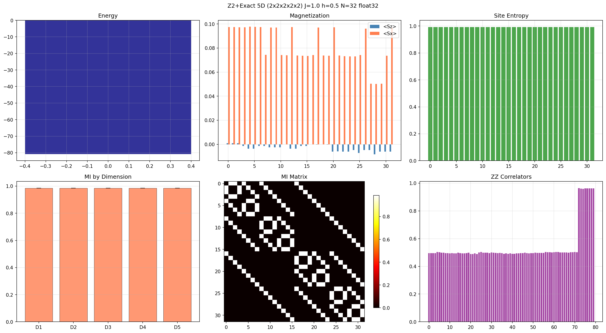
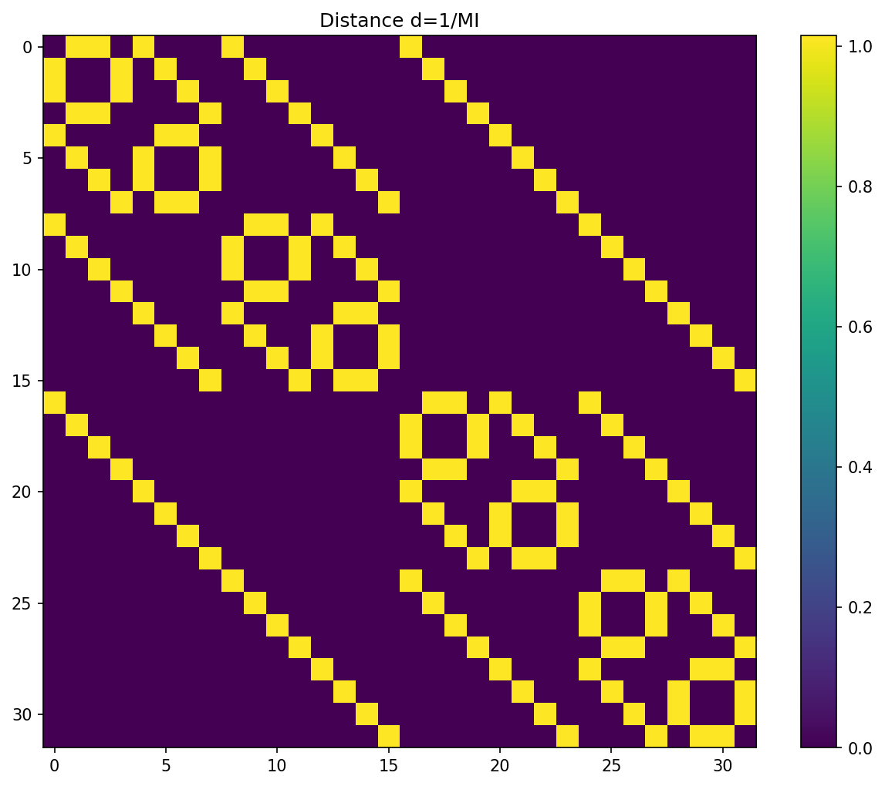

# Dragon Quantum Sim (DQS)
DQS (Dragon Quantum Sim) is a high-performance, memory-optimized engine for Exact Diagonalization of large-scale quantum spin systems. DQS enables 32-qubit simulations on commodity hardware with minimal memory footprint. It is a geometry-agnostic framework designed for scalable, high-precision research in N-dimensional lattices.

**The most memory-efficient exact quantum simulation engine for classical hardware.**

Exact Diagonalization • Z₂ symmetry • Custom 3-Vector Lanczos • Mixed-precision • Any lattice dimension

---
The app allows to use 64 GB RAM classic home PC to simulate and calculate up to 32 qibuts with exact method in reasonable time.

**32 qubits in 5D hypercubic lattice** (Hilbert space = 4,294,967,296 states)  
→ **Ground state computed with only 40.16 GB peak RAM** on a standard desktop PC  
→ Total runtime: **41 min 33 s**

**Ground-state energy:**  
**E₀ = -80.8005030298** (J = 1.0, h = 0.5, Z₂ even parity sector)

**Key observables:**
- Total ⟨Sz⟩ ≈ 0 (Z₂ symmetry preserved to machine precision)
- Average mutual information ⟨MI⟩ = 0.9855429420
- Perfect isotropy across all 5 dimensions (spread < 10⁻⁹)

---

### Visual Results (directly from the 32-qubit run)

**1. Main Results Panel**  

**Description:**
- Top-left: Lanczos-converged ground-state energy
- Top-middle: Site-resolved ⟨Sz⟩ (blue) and ⟨Sx⟩ (orange)
- Top-right: Von Neumann entropy per site (~0.9927 – near maximal entanglement)
- Bottom-left: Average MI per lattice dimension D1–D5 (perfectly flat → 5D isotropy)
- Bottom-middle: Full 32×32 mutual-information matrix (80 bonds)
- Bottom-right: All 80 ZZ correlators

**2. Inverse Mutual-Information Distance Map**  

**Interpretation:**  
Dark violet = strongest quantum correlations (MI ≈ 0.9855).  
Bright yellow loops exactly follow the 5-dimensional hypercube bonds – clear visual proof of lattice isotropy.

---

### Core Innovations

1. **Map-free Z₂ parity projection** – lossless halving of the Hilbert space without any index mapping
2. **Custom 3-Vector Lanczos engine** – only 3 vectors in Phase 1 (eigenvalues) and 4 in Phase 2 (eigenvector) → 32–40 GB peak for 32 qubits
3. **Mixed-precision pipeline** – float32 storage vectors + float64 local accumulators (eliminates cancellation errors)
4. **Observables pipeline** – full-space expansion only after solver finishes (magnetization, ZZ, von Neumann entropy, pairwise MI, dimensional isotropy check)

Full benchmark logs and JSON results are included in the repository (Docs folder by now) (`simulation_log 5d.txt`, `results_Z2_5D_2x2x2x2x2_float32.json`).

---

### Features

- Arbitrary lattice dimensionality (1D–5D tested, higher ready)
- Real or complex Hamiltonians
- Automatic solver selection (`custom_lanczos` for N ≥ 28, fallback to eigsh)
- Complete observables suite: ⟨Sz⟩, ⟨Sx⟩, ZZ correlators, site/pair entropies, mutual information, isotropy analysis
- Checkpointing, live ETA, detailed memory & timing reporting
- Numba-accelerated, fully parallel kernels (scales with all available cores)

---
